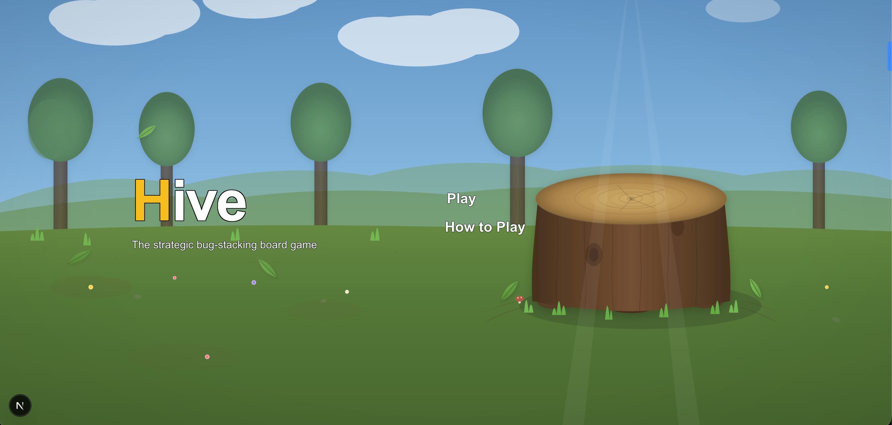
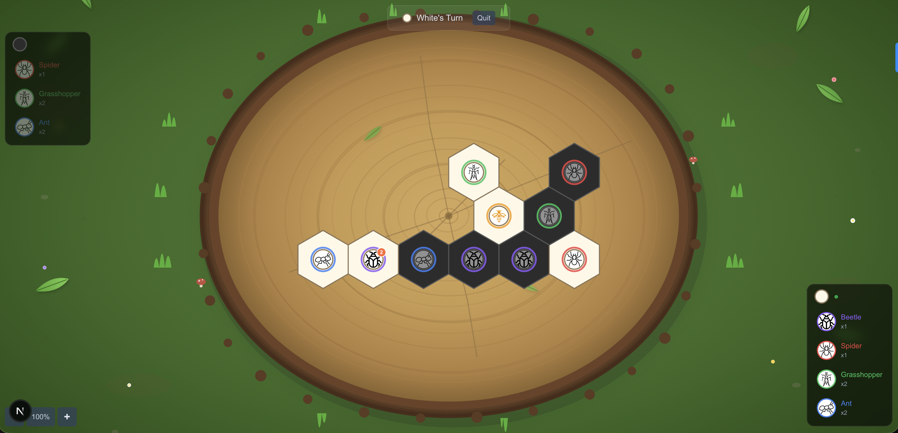

# Hive - Board Game

A web-based implementation of the board game **Hive**, built with Next.js, React, and TypeScript. Play against a friend locally or challenge an AI opponent with three difficulty levels.

## Screenshots

### Menu


### Game


## About the Game

Hive is a strategic two-player board game where each player controls a set of insect tiles. The objective is to completely surround your opponent's Queen Bee on all six sides. Pieces are placed on a hexagonal grid and each insect type moves differently.

### Pieces

| Piece | Count | Movement |
|-------|-------|----------|
| Queen Bee | 1 | Moves 1 space. Must be placed within your first 4 turns. |
| Beetle | 2 | Moves 1 space. Can climb on top of other pieces to pin them. |
| Spider | 2 | Moves exactly 3 spaces around the hive edge. No backtracking. |
| Grasshopper | 3 | Jumps in a straight line over contiguous pieces to the first empty space. |
| Ant | 3 | Moves any number of spaces around the hive edge. |

### Rules

- **Placement**: New pieces must be placed adjacent to your own pieces only (not touching any opponent pieces). Exception: the very first two pieces must be adjacent to each other.
- **Queen deadline**: Your Queen Bee must be placed within your first 4 turns.
- **One Hive rule**: A piece cannot be moved if doing so would split the hive into two disconnected groups.
- **Freedom to move**: A piece cannot slide through a gap that is too narrow (both neighbors occupied).
- **Win condition**: Surround your opponent's Queen Bee on all 6 sides. If both queens are surrounded simultaneously, it's a draw.

## Game Modes

- **Human vs Human** - Play locally on the same screen, taking turns.
- **Human vs Computer** - Challenge the AI with three difficulty levels:
  - **Easy** - Shallow search with occasional random moves.
  - **Medium** - Depth-2 minimax search with full heuristic evaluation.
  - **Hard** - Depth-3 minimax with alpha-beta pruning for stronger play.

## Features

- SVG hexagonal board with drag-to-pan and zoom controls
- Tree stump background for an immersive tabletop feel
- Animated piece placement (drop-in) and movement (slide/jump)
- Per-piece-type insect images and color-coded accent rings
- Hover tooltips describing each piece's abilities
- Floating inventory panels with the human player always at the bottom

## Getting Started

```bash
npm install
npm run dev
```

Open [http://localhost:3000](http://localhost:3000) in your browser.

## Tech Stack

- **Next.js 16** with App Router
- **React 19** with hooks and useReducer for state management
- **TypeScript** with strict mode
- **Tailwind CSS v4** for styling
- **SVG** for hexagonal board rendering
- **Minimax AI** with alpha-beta pruning and heuristic evaluation

## Project Structure

```
app/
  page.tsx                    # Landing page with mode selection
  game/
    page.tsx                  # Game page (server component shell)
    GameClient.tsx            # Main game client component
    game-reducer.ts           # useReducer state management
    use-game-logic.ts         # Custom hook for game effects and handlers

components/
  Board.tsx                   # SVG hexagonal board
  HexTile.tsx                 # Individual hex tile with animation
  Piece.tsx                   # Piece SVG rendering with insect images
  PieceInventory.tsx          # Floating inventory panel
  TurnIndicator.tsx           # Turn status bar with quit button
  GameOverModal.tsx           # Win/draw/loss overlay
  board/
    use-pan-zoom.ts           # Drag-to-pan and zoom hook
    use-move-animation.ts     # Piece animation hook
    use-hexes-to-render.ts    # Board hex computation hook
    ZoomControls.tsx          # Zoom +/-/reset buttons
    TreeStumpBg.tsx           # Tree stump background SVG
  home/
    HeroTitle.tsx             # Landing page title
    PlayMenu.tsx              # Expandable play menu (Human/Computer/Difficulty)
    HowToPlayDialog.tsx       # How to play dialog with piece descriptions
    DifficultySelector.tsx    # AI difficulty buttons
    TreeStumpHomeBg.tsx       # Home screen background SVG

game-logic/
  types.ts                    # TypeScript types and interfaces
  constants.ts                # Game constants (piece counts, hex size)
  hex.ts                      # Axial coordinate math and pixel conversion
  hive-connectivity.ts        # One Hive rule (BFS connectivity check)
  placement.ts                # Piece placement validation
  movement.ts                 # Per-piece movement rules
  game-state.ts               # State creation, move application, win detection
  ai.ts                       # Minimax AI with alpha-beta pruning
```

## Naming Conventions

- **React components** (`.tsx`): PascalCase (`Board.tsx`, `GameClient.tsx`)
- **Hooks** (`.ts`): kebab-case with `use-` prefix (`use-pan-zoom.ts`)
- **Modules** (`.ts`): kebab-case (`game-state.ts`, `hive-connectivity.ts`)
- **Folders**: kebab-case (`game-logic/`, `components/board/`)
- **Functions**: arrow function expressions (`const foo = () => {}`)
